# BHC Markets — Data Model & Database Architecture

This document is the canonical “shape of the data” for BHC Markets.
It describes the tables, relationships, and invariants implied by the current schema in `packages/database/src/schema/*`.

It also calls out **schema drift** where some repositories currently expect columns/tables that are not present in the shared schema yet.

---

## 1) Scope & Principles

**Primary datastore:** PostgreSQL (OLTP).

**Key principles:**
- **Immutability for audits:** ledger entries and admin audit logs are append-only.
- **Precision over floats:** monetary amounts are stored as `numeric`/`decimal`.
- **Account-centric:** balances/holds/positions are anchored on `accounts`.
- **Event-friendly:** most tables include `created_at`/`updated_at` timestamps for auditability.

**Notation:**
- PK = primary key
- FK = foreign key
- “Logical FK” = relationship exists by convention but is not currently enforced as a DB FK.

---

## 2) High-Level Entity Map

### Core lifecycle (simplified)

1. **User** authenticates → session created.
2. User owns one or more **accounts** (often per currency / accountType).
3. User places an **order** for a **symbol**.
4. Order execution creates **trades** (fills).
5. Execution updates **positions** and the **ledger** (balances/holds/entries).
6. **Risk** tables record limits, circuit breaker events, and rate-limit attempts.
7. **Admin audit** logs record admin actions.
8. **Market data** stores ticks/candles for charting/analytics.

---

## 3) ER Diagram (Logical)

```mermaid
erDiagram
  users {
    uuid id PK
    varchar email
    enum status
    enum role
    timestamptz created_at
    timestamptz updated_at
  }

  user_credentials {
    uuid user_id PK
    text password_hash
    int version
    int failed_attempt_count
    timestamptz locked_until
  }

  auth_sessions {
    uuid id PK
    uuid user_id FK
    text refresh_token_hash
    enum status
    timestamptz expires_at
  }

  password_reset_tokens {
    bigserial id PK
    uuid user_id FK
    text token_hash
    timestamptz expires_at
    bool used
  }

  accounts {
    uuid id PK
    uuid user_id FK
    varchar currency
    enum account_type
    enum status
    numeric balance
    numeric locked
  }

  symbols {
    varchar symbol PK
    varchar base_currency
    varchar quote_currency
    bool trading_enabled
    numeric maker_fee
    numeric taker_fee
  }

  orders {
    uuid id PK
    uuid account_id FK
    varchar symbol
    enum side
    enum type
    numeric price
    numeric quantity
    numeric filled_quantity
    enum status
    varchar time_in_force
    timestamptz created_at
  }

  trades {
    uuid id PK
    uuid order_id FK
    numeric price
    numeric quantity
    numeric fee
    timestamptz created_at
  }

  positions {
    uuid id PK
    uuid account_id FK
    varchar symbol
    varchar side
    numeric quantity
    numeric entry_price
    numeric unrealized_pnl
    numeric realized_pnl
  }

  ledger_balances {
    uuid id PK
    uuid account_id "(logical FK)"
    varchar asset
    numeric available
    numeric held
  }

  ledger_holds {
    uuid order_id PK
    uuid account_id
    varchar asset
    numeric amount
  }

  ledger_entries {
    uuid id PK
    uuid account_id
    varchar asset
    enum type
    numeric amount
    enum status
    varchar reference_id
    varchar reference_type
    timestamptz created_at
  }

  symbol_risk_limits {
    varchar symbol PK
    bool trading_enabled
    numeric min_order_size
    numeric max_order_size
    numeric max_price_deviation
  }

  user_risk_limits {
    uuid user_id PK
    bool trading_restricted
    int max_orders_per_minute
    numeric daily_loss_limit
  }

  circuit_breaker_events {
    uuid id PK
    varchar symbol
    enum trigger
    timestamptz activated_at
    timestamptz deactivated_at
  }

  order_attempts {
    uuid id PK
    uuid user_id FK
    varchar symbol
    bool was_approved
    timestamptz attempted_at
  }

  daily_user_pnl {
    uuid id PK
    uuid user_id FK
    date date
    numeric realized_pnl
    numeric trading_fees
    int trade_count
  }

  admin_audit_log {
    uuid id PK
    uuid admin_user_id FK
    varchar action
    varchar target_type
    uuid target_id
    jsonb old_value
    jsonb new_value
    timestamptz created_at
  }

  market_prices {
    bigserial id PK
    varchar symbol
    numeric price
    timestamptz timestamp
    jsonb metadata
  }

  candles {
    serial id PK
    varchar symbol
    varchar timeframe
    decimal open
    decimal high
    decimal low
    decimal close
    decimal volume
    timestamptz timestamp
  }

  users ||--|| user_credentials : "has"
  users ||--o{ auth_sessions : "has"
  users ||--o{ password_reset_tokens : "has"

  users ||--o{ accounts : "owns"
  accounts ||--o{ orders : "places"
  orders ||--o{ trades : "fills"
  accounts ||--o{ positions : "holds"

  accounts ||--o{ ledger_balances : "tracks"
  accounts ||--o{ ledger_entries : "records"
  orders ||--|| ledger_holds : "reserves"

  users ||--|| user_risk_limits : "constrained_by"
  users ||--o{ order_attempts : "attempts"
  users ||--o{ daily_user_pnl : "aggregated"

  users ||--o{ admin_audit_log : "admin_actions"

  symbols ||--o{ orders : "traded_as"
  symbols ||--o{ positions : "position_in"
  symbols ||--o{ market_prices : "priced_by"
  symbols ||--o{ candles : "candled_by"

  symbols ||--|| symbol_risk_limits : "risk_limits"
  symbols ||--o{ circuit_breaker_events : "halts"
```

Notes:
- Several relationships are currently **logical** only (e.g., `ledger_*` tables don’t declare FKs to `accounts`/`orders` in the schema). You can choose to enforce them once you’re confident about lifecycle and deletion policies.

---

## 4) Table Catalog (By Domain)

### 4.1 Auth / Identity (`core.ts`)

**`users`**
- PK: `id`
- Unique: `email`
- Used by: backend auth, admin, risk

**`user_credentials`**
- PK/FK: `user_id → users.id` (cascade delete)
- Stores password hash + lockout state + credential versioning

**`auth_sessions`**
- PK: `id`, FK: `user_id → users.id`
- Unique: `refresh_token_hash` (prevents token reuse)
- Important indexes: `(status, expires_at)` for cleanup

**`password_reset_tokens`**
- PK: `id`, FK: `user_id → users.id`
- Unique: `token_hash`

**Gap: `auth_codes`**
- Your backend repository currently uses an `auth_codes` table, but it is not present in `packages/database/src/schema/core.ts`.

### 4.2 Accounts (`core.ts`)

**`accounts`**
- PK: `id`, FK: `user_id → users.id`
- Tracks `balance` and `locked` (legacy/compat); the ledger is intended to be the authoritative source long term.
- Index: `idx_accounts_user (user_id)`

Design note:
- The repo shows both **account balances** and **ledger balances** existing. Decide which one is authoritative (recommendation: **ledger_balances** is authoritative; `accounts.balance/locked` becomes a denormalized cache or is deprecated).

### 4.3 Trading (Orders/Trades/Positions) (`core.ts`)

**`symbols`**
- PK: `symbol`
- Stores base/quote currencies, fees, and display precision.

**`orders`**
- PK: `id`, FK: `account_id → accounts.id`
- Fields: `symbol`, `side`, `type`, `price?`, `quantity`, `filled_quantity`, `status`, `time_in_force?`
- Indexes: by `account_id`, `symbol`, `status`

**`trades`**
- PK: `id`, FK: `order_id → orders.id`
- Fields: `price`, `quantity`, `fee`, `created_at`

**`positions`**
- PK: `id`, FK: `account_id → accounts.id`
- Unique: `(account_id, symbol)`
- Fields: `side`, `quantity`, `entry_price?`, `unrealized_pnl`, `realized_pnl`

### 4.4 Ledger (`ledger.ts`)

**`ledger_balances`**
- Unique: `(account_id, asset)`
- Fields: `available`, `held`

**`ledger_holds`**
- PK: `order_id`
- Tracks funds reserved for an order

**`ledger_entries`** (append-only)
- Fields: `type`, `amount`, `status`, plus optional `reference_id/reference_type`
- Indexes: account, (account+asset), reference id, type, createdAt

Design notes:
- `ledger_entries` is the system-of-record audit trail.
- `ledger_balances` is a projection (“current state”) optimized for reads.

### 4.5 Market Data (`market.ts`)

**`market_prices`**
- Time-series “flex table”: stores ticks and/or candles via `metadata`.
- Indexes: `symbol`, `timestamp`, `(symbol, timestamp)`

**`candles`**
- Dedicated OHLCV table with unique `(symbol, timeframe, timestamp)`.

Design note:
- Your `TickRepository` persists candles into `market_prices` metadata; you also have a dedicated `candles` table. Pick one as canonical to avoid duplication.

### 4.6 Risk (`risk.ts`)

**`symbol_risk_limits`**
- PK: `symbol`

**`user_risk_limits`**
- PK/FK: `user_id → users.id`

**`circuit_breaker_events`**
- PK: `id`
- Nullable `symbol` supports “global” halts

**`order_attempts`**
- Used for rate limiting, compliance visibility

**`daily_user_pnl`**
- Aggregated realized pnl/fees/trade count per user/date

### 4.7 Admin (`admin.ts`)

**`admin_audit_log`** (append-only)
- PK: `id`, FK: `admin_user_id → users.id`
- Tracks action metadata + old/new JSON blobs

---

## 5) Schema Drift (Important)

Several repositories currently **query/insert columns and tables that are not present** in the shared Drizzle schema.
This matters because it prevents you from having a single “truth” about the database.

### Observed mismatches

**Order Engine → `orders` table** expects (at least):
- `stop_price`, `client_order_id`, `average_fill_price`, `expires_at`, `cancelled_at`, `cancel_reason`, and sometimes `user_id`.
- Shared schema `orders` currently has none of those, and its `status` enum differs (schema includes `new`, repo writes `'open'`).

**Order Engine → `trades` table** expects a maker/taker model:
- `maker_order_id`, `taker_order_id`, `maker_account_id`, `taker_account_id`, `maker_fee`, `taker_fee`, `status`, `settled_at`, plus `symbol`.
- Shared schema `trades` currently attaches trades to a single `order_id` only.

**Order Engine → `positions` table** expects:
- `average_entry_price` and `cost_basis`.
- Shared schema uses `entry_price` and has no `cost_basis`.

**Order Engine → `position_history` table**
- Repository reads/writes `position_history`, but no schema table exists yet.

**Backend Auth → `auth_codes` table**
- Repository uses `auth_codes`, but schema does not define it.

### Recommendation
Pick one of these strategies and commit to it:

1) **Evolve the shared schema to match engine/backends** (recommended if the engine is the long-term truth), then regenerate migrations.

2) **Refactor repositories to match the shared schema**, removing legacy columns/tables and standardizing enums/statuses.

Either way, the first step is this document + an explicit “source of truth” decision.

---

## 6) Likely Missing Pieces for a Real Trading Platform

These aren’t required for a toy prototype, but they become important quickly.
Consider them a roadmap checklist.

### Funding & payments
- `deposits`, `withdrawals` (status machine: requested/approved/sent/confirmed/failed)
- `payment_methods` / `bank_accounts` / `crypto_addresses`
- `blockchain_transactions` (txid, chain, confirmations, reorg handling)
- `fees` associated with withdrawals/deposits

### Execution correctness & auditability
- `order_events` (append-only): state transitions, rejects, cancels, amendments
- `fills` as first-class records (if you want trades as “match events”, fills are often per-order)
- **idempotency** table/keys for public API commands (create order, cancel order, withdrawal requests)

### Product coverage (stocks/forex/derivatives)
- `instruments` / `venues` / `trading_sessions` (market hours/holidays)
- Corporate actions: `splits`, `dividends`, `symbol_changes`
- Margin/futures: `margin_accounts`, `collateral`, `liquidations`, `funding_rates`, `borrow_lend`, `interest_accrual`

### Risk, compliance, and security
- KYC/AML: `kyc_profiles`, `kyc_documents`, `sanctions_hits`, `risk_flags`
- Login/security events: `user_security_events`, suspicious IP tracking
- Trade surveillance: wash trading alerts, self-trade prevention logs

### Data volume & performance
- Partitioning strategy for time-series and event tables (`market_prices`, `order_events`, `ledger_entries`, `trades`).
- Retention policies (raw ticks vs aggregated candles).
- Read replicas / separate analytics store for BI.

---

## 7) Next Concrete Steps

If you want, I can turn this into an actionable “schema alignment” task list, but the typical next steps are:

1. Decide whether **order-engine** persistence format is canonical for `orders/trades/positions`.
2. Align enums/statuses (`order_status` especially) across services.
3. Add missing tables (`auth_codes`, `position_history`) or remove usage.
4. Decide whether `candles` or `market_prices(metadata)` is the canonical candle store.
5. Add or intentionally avoid FKs for `ledger_*` depending on deletion/archival policy.

---

## 8) Proposed “Dense” Canonical Schema (vNext Blueprint)

This section intentionally goes **beyond** what exists today.
Think of it as a **checklist + target model** for a production-grade multi-asset broker/exchange.

Guiding design goals:
- Keep **OLTP** tables normalized and auditable.
- Keep **append-only** where legally/operationally important (ledger, order events, audit logs).
- Expect multiple products (spot, margin, futures), multiple rails (fiat + crypto), and multiple venues.
- Treat **idempotency** as a first-class concern.

### 8.1 Reference Data (Assets, Instruments, Venues)

These tables prevent “stringly-typed symbols” from spreading across the system.

**`assets`**
- PK: `code` (e.g., `USD`, `BTC`, `AAPL`)
- Type: `fiat | crypto | equity | commodity | fx`
- Precision rules: `decimals`, `display_decimals`
- Metadata: name, issuer, chain/network info (for crypto), country/exchange info (for equities)

**`venues`**
- PK: `id`
- Type: `internal_matching | external_broker | external_exchange`
- Connectivity metadata + trading hours reference

**`instruments`**
- PK: `id`
- Uniques: `symbol` (human), possibly `(venue_id, venue_symbol)`
- References: `base_asset`, `quote_asset` (FK → `assets.code`)
- Product: `spot | margin | perpetual | futures | cfd`
- Trading rules: tick size, lot size, min/max order, price bands

**`instrument_trading_sessions`**
- PK: `id`, FK: `instrument_id`
- Stores market hours / holidays / half-days (esp. for equities/forex)

**Why it matters:** you’ll eventually need canonical assets (for ledger), and canonical instruments (for trading + market data).

### 8.2 Identity, Access Control, and Security

**`users`** (exists)

**`user_profiles`**
- PK/FK: `user_id → users.id`
- Legal name, DOB (encrypted), address (structured), residency, tax residency, etc.

**`user_contact_methods`**
- PK: `id`, FK: `user_id`
- Email/phone with verification state + timestamps

**`user_2fa_methods`**
- PK: `id`, FK: `user_id`
- `totp`, `webauthn`, `sms` (discouraged), backup codes

**`api_keys`**
- PK: `id`, FK: `user_id`
- Key hash, name, scopes, IP allowlist, last-used

**`oauth_clients` / `oauth_tokens`** (optional)
- Needed if you expose third-party integrations

**`user_security_events`** (append-only)
- PK: `id`, FK: `user_id`
- Login, failed login, device change, 2FA changes, suspicious activity flags

**`devices`** (optional)
- PK: `id`, FK: `user_id`
- Device fingerprinting for session management

### 8.3 Compliance (KYC/AML)

Even if you don’t implement KYC immediately, a schema placeholder keeps the system extensible.

**`kyc_cases`**
- PK: `id`, FK: `user_id`
- Status: `not_started | pending | approved | rejected | expired`
- Provider ref, review metadata, timestamps

**`kyc_documents`**
- PK: `id`, FK: `kyc_case_id`
- Type: passport/license/proof_of_address
- Storage references (encrypted), expiration dates

**`aml_flags`** (append-only)
- PK: `id`, FK: `user_id`
- Reason codes, severity, resolution metadata

**`sanctions_screenings`**
- PK: `id`, FK: `user_id`
- Provider, match score, matched entity info

### 8.4 Account Model (Brokerage vs Ledger)

Right now you have `accounts` + ledger tables. vNext typically separates:

**`trading_accounts`**
- PK: `id`, FK: `user_id`
- Product: spot/margin/futures/demo
- Status, risk tier, metadata

**`subaccounts`** (optional but common)
- PK: `id`, FK: `trading_account_id`
- Lets users segment strategies/portfolios

**`ledger_accounts`**
- PK: `id`
- FK: `trading_account_id`
- One logical ledger account per (user × product) or per subaccount

**`ledger_balances`**, **`ledger_entries`**, **`ledger_holds`** (exist but would FK to `ledger_accounts`)

**Key invariant:** any monetary state change should be reconstructable from `ledger_entries`.

### 8.5 Orders, Execution, and Market Structure

Production systems usually store **commands**, **state**, and **events** separately.

**`orders`** (state)
- PK: `id`
- FK: `trading_account_id` (or `ledger_account_id`)
- FK: `instrument_id`
- Fields: side/type/TIF, price/stop/limit, quantity, filled, status
- Client correlation: `client_order_id` unique per account

**`order_events`** (append-only)
- PK: `id`, FK: `order_id`
- Event types: created, accepted, rejected, amended, partially_filled, filled, cancelled, expired
- Stores actor + reason codes + before/after snapshots (or deltas)

**`fills`** (per-order executions)
- PK: `id`
- FK: `order_id`
- FK: `match_id` (optional)
- Quantity, price, fee, liquidity (maker/taker), timestamps

**`matches` / `trades`** (market-level executions)
- PK: `id`
- FK: `instrument_id`
- maker_order_id, taker_order_id
- price, quantity, executed_at

**`order_rejections`**
- PK: `order_id` (or separate id)
- Structured rejection codes for analytics and client UX

**`self_trade_prevention_events`** (append-only)
- Helps with exchange integrity and compliance

**`idempotency_keys`**
- PK: `id`
- Unique: `(user_id, key)`
- Stores request hash + response payload pointer + status

### 8.6 Positions and Portfolio Accounting

**Spot positions** can be derived from balances, but for leveraged products you’ll want explicit positions.

**`positions`** (state)
- PK: `id`
- FK: `trading_account_id`
- FK: `instrument_id`
- Net quantity, avg entry price, realized/unrealized PnL, timestamps

**`position_events`** (append-only)
- PK: `id`, FK: `position_id`
- Describes changes from fills, funding, liquidation, corporate actions

**`position_lots`** (optional; for tax and equities)
- Tracks FIFO/LIFO tax lots, cost basis per lot

**`portfolio_snapshots`**
- PK: `(trading_account_id, timestamp)`
- Stores NAV, margin metrics, exposure by asset/instrument

### 8.7 Funding, Deposits, Withdrawals, and Transfers

These are some of the most commonly “forgotten until needed” parts.

**`payment_rails`**
- PK: `id`
- Type: `ach | sepa | wire | card | crypto`

**`bank_accounts`**
- PK: `id`, FK: `user_id`
- Bank metadata; store sensitive fields encrypted/tokenized

**`crypto_addresses`**
- PK: `id`, FK: `user_id`
- Chain/network, address, label, whitelisting + risk flags

**`deposits`**
- PK: `id`, FK: `user_id`, FK: `asset_code`
- Status machine: created → pending → confirmed → credited / failed
- External refs: bank transfer ids or blockchain tx ids

**`withdrawals`**
- PK: `id`, FK: `user_id`, FK: `asset_code`
- Status machine: requested → approved → sent → confirmed / failed
- Withdrawal fees, travel rule / compliance metadata

**`internal_transfers`**
- PK: `id`
- From/to ledger accounts, asset, amount

**Ledger linkage:** deposits/withdrawals/transfers should generate `ledger_entries` with clear `reference_type/reference_id`.

### 8.8 Fees, Tiers, Rebates, and Revenue

**`fee_schedules`**
- PK: `id`
- Maker/taker per instrument or instrument group

**`fee_tiers`**
- PK: `id`
- Thresholds based on rolling volume (e.g., 30-day)

**`user_fee_tier_assignments`**
- PK/FK: `user_id`
- Effective range (from/to)

**`rebates` / `promotions`**
- Referral rebates, maker programs, etc.

### 8.9 Margin / Futures (When You Add Leverage)

If you add margin or futures, you’ll need at least:

**`margin_requirements`**
- Per instrument/product: initial/maintenance margin

**`borrow_lend_positions`**
- Borrowed asset, interest accrual, collateral linkage

**`funding_rates`** and **`funding_payments`** (perpetuals)

**`liquidation_events`** (append-only)
- Captures triggers, executed quantities, penalties, and audit

### 8.10 Market Data (Time-Series at Scale)

Beyond `market_prices`/`candles`:

**`order_book_snapshots`** (optional)
- For replay/analytics; usually stored in cheaper systems, but schema helps

**`mark_prices`**
- Needed for derivatives and risk (index price / mark price / fair price)

**Retention strategy:** raw ticks are high-volume; plan partitioning and archival early.

### 8.11 Operations, Support, and Messaging

**`support_tickets`**, **`support_messages`**
- Needed for real operations (and to explain “what happened” to users)

**`notifications`**
- Email/SMS/push notifications; delivery status tracking

**`webhook_subscriptions`**, **`webhook_deliveries`**
- For client integrations (trades/orders/balances events)

### 8.12 Audit and Observability

You already have:
- `admin_audit_log` (append-only)

Common additions:
- **`service_audit_log`** (append-only) for system actions (risk halts, migrations, backfills)
- **`data_corrections`** (append-only) for rare manual fixes (with approvals)

---

## 9) Minimal “Don’t Forget These” Invariants

If you implement only a few of the above immediately, keep these invariants in mind:

1. **Every money movement emits ledger entries** with stable references.
2. **Every order state change emits an order event** (even rejects).
3. **Idempotency is enforced** for external-facing commands.
4. **Risk decisions are traceable** (why an order was blocked, why trading halted).
5. **Compliance artifacts are immutable** (audit logs, AML flags, admin actions).
